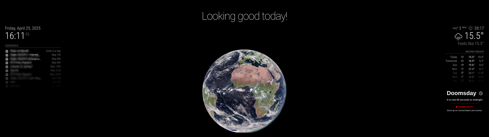
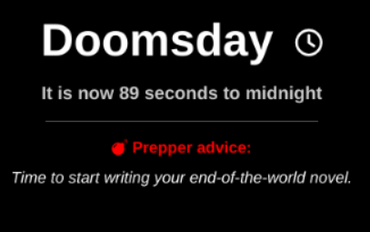

# 🧨 MMM-DoomsdayClock

> *"Because when society is circling the drain, at least your mirror can tell you how fast it’s spinning."*

---




## 🪦 Exordium

Let’s face it: humanity peaked somewhere between inventing pizza and discovering how to open beer bottles with a lighter. Since then, it’s been a solid free-fall — aided generously by political chaos, influencers doing the cinnamon challenge, and billionaires trying to buy planets. 🙄

And in this glorious age of AI-generated nonsense and TikTok-powered stupidity, it’s never been more important to know exactly *how close we are to pressing the big red button*.

This module brings the **Bulletin of Atomic Scientists' Doomsday Clock** right to your MagicMirror². So the next time your smart mirror says “89 seconds to midnight,” you’ll know it’s time to cancel your gym subscription and start digging that bunker.

---

## 💣 Features

- Fetches the **actual** Doomsday Clock time (because we like to keep it real — or real depressing).
- Offers **rotating prepper advice**, because if you’re going to perish, you might as well laugh first.
- Easy to extend with your own sarcasm-packed `advice.json` file.
- Fully compatible with your apocalypse prep aesthetic.

---

## 🧪 Installation

Assuming you have MagicMirror² installed and are still functioning as a somewhat logical human:

```bash
cd ~/MagicMirror/modules
git clone https://github.com/crimsonclyde/MMM-DoomsdayClock.git
cd MMM-DoomsdayClock
npm install
```

## ⚙️ Configuration

Add the module to your config/config.js file:

```java
{
  module: "MMM-DoomsdayClock",
  position: "top_right",
  config: {
    updateInterval: 24 * 60 * 60 * 1000 // Update once a day, because the end is near but not *that* near
  }
},
```




## 📚 Understanding advice.json

The true genius of this module lies in advice.json — your bunker-friendly message board. Here's how it works:

```json
[
  {
    "maxSeconds": 300,
    "advice": [
      "Stock up on canned beans and memes.",
      "The bunker isn't going to dig itself!",
      "Time to start writing your end-of-the-world novel."
    ]
  }
]
```

**maxSeconds**: This is the upper limit for this batch of advice. If we're within this number of seconds from midnight, one of these gems will be randomly shown.

You can have multiple blocks, e.g. 1200, 600, 300 seconds — like a tiered “how-screwed-are-we” system.
Advice rotates every 15 seconds (you know, for suspense).
Add your own wisdom! The more absurd, the better.

## 🧹 Uninstallation

Decided you'd rather face the end blissfully unaware? No problem. Here's how to remove the Doomsday Clock from your MagicMirror²:

1. Remove the module entry from your `config/config.js` file.
2. Delete the module directory:

```bash
cd ~/MagicMirror/modules
rm -rf MMM-DoomsdayClock
```

##  🐒 Why Though?
Because clearly, the apes should’ve stayed in the trees. But noooo. We discovered fire, invented the wheel, built WiFi... and then used it to post selfies in front of mushroom clouds.

So now? Now we watch the clock. Because the only thing left to do is laugh, prep, and pray your WiFi holds long enough to pull the next JSON update.

## ☠️ Disclaimer
This module will not save you from actual nuclear war, climate collapse, or your neighbor’s loud social media escapades. 
It might, however, give you a chuckle on the way out. You’re welcome.